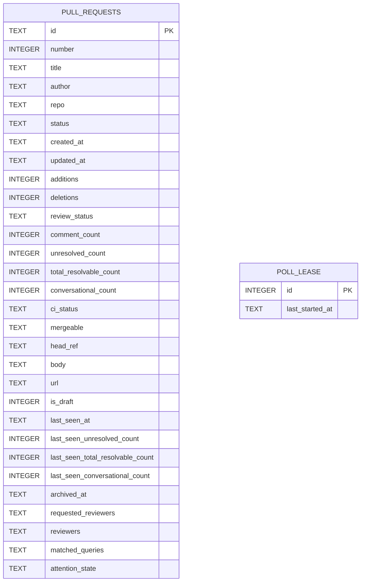

# SQLite Refactor Plan

## Motivation

The current TOML-based storage uses two separate files (`state.toml` / `archive.toml`) to
represent active and archived PRs. This allows a PR to exist in both simultaneously — a class
of bug that a single table with a NOT NULL-constrained `archived_at` column makes structurally
impossible. Additional complexity (file rotation, `fs2` locking, legacy-corruption recovery) also
disappears.

No data migration is required — start from a clean database.

---

## Schema



### Full DDL with enum values

```sql
CREATE TABLE pull_requests (
    id                               TEXT PRIMARY KEY,
    number                           INTEGER NOT NULL,
    title                            TEXT NOT NULL,
    author                           TEXT NOT NULL,
    repo                             TEXT NOT NULL,
    -- 'Open' | 'Closed' | 'Merged'
    status                           TEXT NOT NULL,
    created_at                       TEXT NOT NULL,  -- ISO 8601
    updated_at                       TEXT NOT NULL,  -- ISO 8601
    additions                        INTEGER NOT NULL,
    deletions                        INTEGER NOT NULL,
    -- 'Pending' | 'Approved' | 'ChangesRequested'
    review_status                    TEXT NOT NULL,
    comment_count                    INTEGER NOT NULL,
    unresolved_count                 INTEGER NOT NULL,
    total_resolvable_count           INTEGER NOT NULL,
    conversational_count             INTEGER NOT NULL,
    -- 'Pending' | 'Passing' | 'Failing' | 'Skipped'
    ci_status                        TEXT NOT NULL,
    -- 'Mergeable' | 'Conflicting' | 'BlockedByRequirements' | 'Unknown'
    mergeable                        TEXT NOT NULL,
    head_ref                         TEXT NOT NULL,
    body                             TEXT NOT NULL,
    url                              TEXT NOT NULL,
    is_draft                         INTEGER NOT NULL,  -- 0 | 1

    last_seen_at                     TEXT,              -- ISO 8601, nullable
    last_seen_unresolved_count       INTEGER NOT NULL,
    last_seen_total_resolvable_count INTEGER NOT NULL,
    last_seen_conversational_count   INTEGER NOT NULL,

    -- NULL = active, non-NULL = archived (ISO 8601 timestamp)
    -- Enforces mutual exclusion: a PR cannot be in both lists
    archived_at                      TEXT,

    -- JSON: ["login1", "login2"]
    requested_reviewers              TEXT NOT NULL DEFAULT '[]',
    -- JSON: [{"login": "...", "status": "APPROVED|CHANGES_REQUESTED|COMMENTED|PENDING"}, ...]
    reviewers                        TEXT NOT NULL DEFAULT '[]',
    -- JSON: ["query-slug-1", ...]
    matched_queries                  TEXT NOT NULL DEFAULT '[]',
    -- JSON: {"active_reasons": ["ReviewRequested|ReReviewRequested|Mentioned|CommentReply|
    --         CiFailed|ChangesRequested|MergeConflict|Approved|NewComments", ...],
    --        "last_seen_at": "...", "last_comment_at": "..."}
    attention_state                  TEXT NOT NULL DEFAULT '{}'
) STRICT;
```

`STRICT` mode makes SQLite enforce declared column types, preventing accidental type coercions.

```sql
CREATE TABLE poll_lease (
    id              INTEGER PRIMARY KEY CHECK (id = 1),  -- singleton row
    last_started_at TEXT NOT NULL DEFAULT '1970-01-01T00:00:00Z'
);
INSERT OR IGNORE INTO poll_lease (id) VALUES (1);
```

The `CHECK (id = 1)` constraint enforces that only one row can ever exist.

---

## Thread safety

`rusqlite::Connection` is `Send` but not `Sync`. `StateRepository` requires `Send + Sync` (it is
held as `Arc<dyn StateRepository>`). The connection must therefore be wrapped in a `Mutex`:

```rust
pub struct SqliteStateRepository {
    conn: Mutex<rusqlite::Connection>,
}
```

`Mutex<Connection>` satisfies `Send + Sync` because `Connection: Send`. All trait method
implementations lock the mutex for the duration of the call; SQLite itself serializes concurrent
writers, so no deadlock risk.

### Connection setup

Set these PRAGMAs immediately after opening the connection in `SqliteStateRepository::new`:

```sql
PRAGMA journal_mode=WAL;
PRAGMA busy_timeout=5000;
```

WAL mode allows concurrent readers while a write is in progress, preventing UI freezes during
polls. `busy_timeout` causes SQLite to retry for up to 5 seconds on a locked database rather than
immediately returning `SQLITE_BUSY`.

---

## Dependencies

Add to `Cargo.toml`:

```toml
[dependencies]
rusqlite = { version = "0.32", features = ["bundled"] }
```

The `bundled` feature statically links SQLite — no system library required.

Remove from `Cargo.toml` once the refactor is complete:
- `fs2` — used only in `lock.rs`, which is deleted (see multi-instance section below)
- `toml` — **keep**: still used by `config/watcher.rs` and `config/mod.rs` for `config.toml`

`serde_json` is already present and covers the JSON columns.

---

## Multi-instance model

The existing `FileLock` / `is_writer` mechanism elected one "writer" instance that polled GitHub,
saved state, and sent notifications; other instances were read-only.

With SQLite, all instances share the same database and can write freely. To avoid redundant GitHub
API calls, instances coordinate via the `poll_lease` table using **optimistic concurrency**: the
first instance to successfully claim the lease for a given interval is the one that polls; others
skip that cycle.

### Lease acquisition

Before each polling cycle, an instance reads `last_started_at` and attempts:

```sql
UPDATE poll_lease
SET    last_started_at = <now>
WHERE  id = 1
  AND  last_started_at = <value_we_just_read>
  AND  last_started_at < <now - interval>
```

- `rows_affected == 1` → this instance won the lease; proceed with polling
- `rows_affected == 0` → another instance beat us or the interval hasn't elapsed; skip this cycle

SQLite serializes writes atomically, so no two instances can win the same cycle. There is no
explicit lock release — the lease expires naturally once `interval` elapses from `last_started_at`.

### Crash tolerance

If an instance crashes mid-poll, `last_started_at` remains set. No other instance will poll until
the interval elapses from that timestamp — at most one interval of stale data, which is acceptable.

### Non-lease-winner refresh

Instances that lose the lease still need to refresh their UI with data written by the winner.
SQLite has no cross-process change notification, so losers read from the DB directly at each
polling tick:

```
each polling tick:
  if try_acquire_poll_lease() → call GitHub → save_state → send AppEvent::PrsUpdated
  else                        → load_state  → send AppEvent::PrsUpdated
```

Both paths send `AppEvent::PrsUpdated`; the App event loop updates its in-memory `pr_list` from
the event payload without calling `save_state` itself. This replaces `StateWatcher` entirely.

`AppEvent::StateReloaded` is deleted — `PrsUpdated` now covers both cases. The `notify` crate
stays because `ConfigWatcher` still needs it.

### Save responsibility

`PollingWorker` owns all persistence calls:

- **Lease won**: call GitHub → `state_repo.save_state(prs)` → send `AppEvent::PrsUpdated(prs)`
- **Lease lost**: `state_repo.load_state()` → send `AppEvent::PrsUpdated(prs)`

The App event loop **does not** call `save_state`. Remove the existing `if self.is_writer { save_state(…) }` block in the `PrsUpdated` handler.

### Trait change

`try_acquire_poll_lease(interval: Duration) -> Result<bool>` is added to `StateRepository` so the
polling worker can call it through the existing DI boundary. The `mockall` mock gains this method;
tests that don't care about polling return `true` by default.

### Files and fields deleted

| Item | Location |
|---|---|
| `FileLock` struct | `src/storage/lock.rs` (whole file deleted) |
| `StateWatcher` struct | `src/config/watcher.rs` (struct + `impl` deleted; `ConfigWatcher` stays) |
| `is_writer` field | `src/app.rs` and `src/input.rs` — remove field and all `if app.is_writer { … }` / `if self.is_writer { … }` guards (8 guards in `input.rs` alone) |
| `_lock` field | `src/app.rs` |
| `state_watcher` field | `src/app.rs` |
| `AppEvent::StateReloaded` variant | `src/app.rs` — remove variant, match arm, and handler; `PrsUpdated` replaces it |
| `save_state` call in `PrsUpdated` handler | `src/app.rs` — `PollingWorker` now owns saving (see save responsibility section) |
| `fs2` crate | `Cargo.toml` |

---

## Implementation Steps

1. **Add `rusqlite` to `Cargo.toml`; remove `fs2`.**

2. **Create `src/storage/sqlite.rs`** — `SqliteStateRepository` struct that:
   - Holds `Mutex<rusqlite::Connection>`
   - Opens (or creates) the database at `{data_dir}/ghwatch.db`
   - Sets `PRAGMA journal_mode=WAL` and `PRAGMA busy_timeout=5000` immediately after open
   - Runs `CREATE TABLE IF NOT EXISTS` for both `pull_requests` and `poll_lease` on construction
   - Implements `StateRepository` from `src/domain/ports.rs`

3. **Implement `StateRepository`:**
   | Method | SQL |
   |---|---|
   | `load_state` | `SELECT … WHERE archived_at IS NULL` |
   | `save_state` | Transaction: delete where `archived_at IS NULL`, then insert all |
   | `load_archive` | `SELECT … WHERE archived_at IS NOT NULL ORDER BY updated_at DESC` |
   | `save_archive` | Transaction: delete where `archived_at IS NOT NULL`, then insert all |
   | `archive_pr` | `INSERT OR REPLACE` with `archived_at = datetime('now')` |
   | `try_acquire_poll_lease` | Optimistic UPDATE described in multi-instance section |

4. **Add `try_acquire_poll_lease` to `StateRepository` trait** in `src/domain/ports.rs`:
   ```rust
   fn try_acquire_poll_lease(&self, interval: std::time::Duration) -> Result<bool>;
   ```

5. **Serialize/deserialize helpers** — `pr_to_row` / `row_to_pr` convert between `PullRequest`
   and the flat column set. JSON columns use `serde_json::to_string` / `serde_json::from_str`.
   Timestamps use `chrono::DateTime::to_rfc3339` for writing and `DateTime::parse_from_rfc3339`
   for reading. Enum variants must round-trip as their exact schema strings (e.g.
   `"ChangesRequested"`, `"BlockedByRequirements"`) — confirm `serde` derive tags match before
   finalizing `row_to_pr`.

6. **Wire the polling worker** — pass `Arc<dyn StateRepository>` to `PollingWorker`. At each
   polling tick:
   - Call `try_acquire_poll_lease(interval)`.
   - **Won** (`true`): fetch from GitHub → call `state_repo.save_state(prs)` → send
     `AppEvent::PrsUpdated(prs)`.
   - **Lost** (`false`): call `state_repo.load_state()` → send `AppEvent::PrsUpdated(prs)`.

   The App event loop's `PrsUpdated` handler updates in-memory state only — it does not call
   `save_state`.

7. **Wire up in `src/app.rs`** — replace `FileStateRepository::new(…)` with
   `SqliteStateRepository::new(…)`.

8. **Update `MockStateRepository`** — add a default expectation for `try_acquire_poll_lease`
   returning `Ok(true)` in tests that don't exercise polling coordination.

9. **Remove multi-instance logic from `src/app.rs` and `src/input.rs`:**
   - `src/app.rs`: delete `_lock`, `is_writer`, `state_watcher` fields; remove `FileLock` import and acquisition block; remove `StateWatcher` construction; remove `AppEvent::StateReloaded` variant, its match arm, and its handler; remove `save_state` call from the `PrsUpdated` handler (now done by `PollingWorker`)
   - `src/input.rs`: remove all `if app.is_writer { … }` guards — 8 occurrences across the archive view (`d`, `f` keys), settings view (config reload after save), and normal view (`f` follow, `m`/`M` mark-seen, `u` unfollow, open-in-browser-marks-seen). Make every action unconditional.

10. **Remove `StateWatcher` from `src/config/watcher.rs`** — delete the struct, `impl`, and its
    test. `ConfigWatcher` is unaffected.

11. **Update `src/storage/mod.rs`** — expose `sqlite` module, remove `local`, `archive`, `lock`
    module declarations.

12. **Delete dead files:**
    - `src/storage/local.rs`
    - `src/storage/archive.rs`
    - `src/storage/lock.rs`

13. **Run `cargo check`, `cargo clippy`, `cargo test`** — fix all errors and warnings.

---

## Testing

The existing `StateRepository` tests in `local.rs` move to `sqlite.rs` with minimal changes
(swap `FileStateRepository::new` for `SqliteStateRepository::new`; temp-dir setup stays the
same). The mutual-exclusion invariant gets an explicit new test:

```
test_archive_pr_not_visible_in_load_state
```

The poll lease gets its own test:

```
test_try_acquire_poll_lease_first_instance_wins
test_try_acquire_poll_lease_second_instance_skips
test_try_acquire_poll_lease_reacquires_after_interval
```

The rest of the app already depends only on the `StateRepository` trait — no other mock changes needed.
